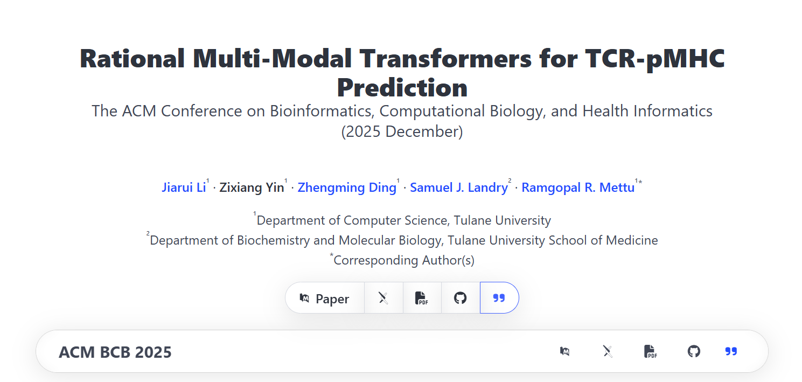

# 🧾 Paper Page: Transform Your Paper into a Web Page Effortlessly

**Paper Page** is a lightweight, standalone HTML tool that automatically generates a professional web page for your scientific paper — no coding required.  
Simply provide a configuration file, and Paper Page takes care of the rest.

👉 [**Demo Page**](https://www.jiarui-li.com/papers/BCB2025EGM/) — example for our BCB'25 publication.

## 🚀 Features
- Generate a publication webpage instantly  
- Fully standalone (just one HTML file)  
- Customizable through a simple config file  
- Responsive design — supports both desktop and mobile devices  

## Updates
- Support title customization (Contributed by Zach)

👤 Maintained by [**Jiarui Li**](http://jiarui.li)

Contributors:
- [**Zach**](https://zachyin.com)

## ⚙️ Getting Started

1. Add the following files to your website hosting folder:  
   - [`index.html`](source/index.html)  
   - [`paper.paml`](source/paper.paml)  
   - [`README.pmd`](source/README.pmd)

2. Deploy your website as usual.  
   The `index.html` file will automatically render the `paper.paml` file located in the same directory.

## 🎨 Customize Your Page

To customize your paper page, modify the `paper.paml` file according to the following structure:

### 🧩 Paper Section
- `title` (`string`): Title of your paper  
- `publication` (`string`): Full publication name  
- `abbr` (`string`): Abbreviated publication name  
- `date`:  
  - `year` (`number`): Publication year  
  - `month` (`string`): Publication month  

### 👥 Author Section
- `name` (`string`): Author name  
- `affiliation` (`string`): Author affiliation (auto-numbered and merged if identical)  
- `link` (`string`, optional): URL to author profile or homepage  
- `corresponding` (`bool`): Whether the author is the corresponding author  
- `equal` (`bool`): Whether the author contributed equally  

### 🔗 Links Section
*(List of link objects)*  
- `name` (`string`): Button text  
- `link` (`string`): URL for the button  
- `icon` (`string`): FontAwesome or Academic Icons ID (see [FontAwesome](https://fontawesome.com/icons) and [AcademicIcons](https://jpswalsh.github.io/academicons/))  
- `expand` (`bool`): Whether the button is expanded by default  

### 📚 Citations Section
*(List of citation entries)*  
- `[Cite Format]` (`string`): Citation content  

### 📄 Document Section
- `path` (`string`): Default `"./README.pmd"` — the markdown file rendered as main content  
- `centered` (`bool`): Whether to center the content  
- `footer` (`string`): Footer text shown at the bottom of the page

## Dependencies
All dependcies are requested from public CDN.
- Bulma
- font-awesome
- academicons
- jquery
- marked
- js-yaml
- qrcode